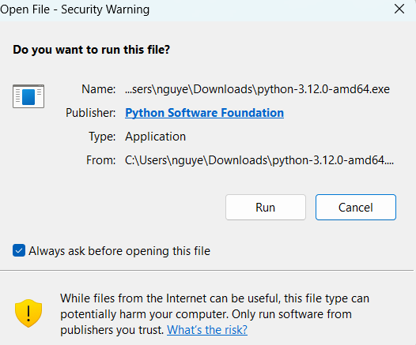
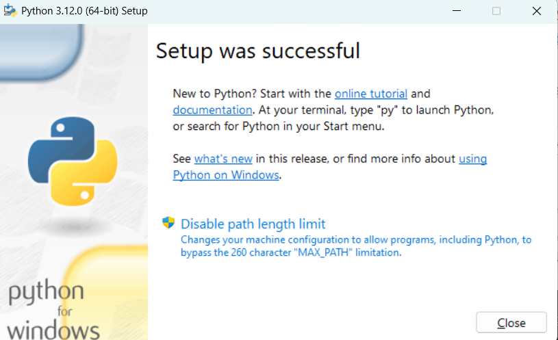
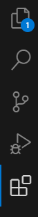
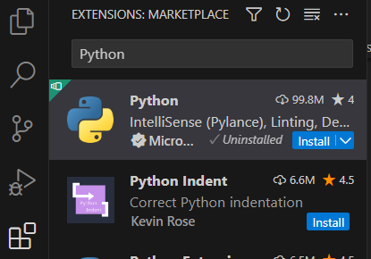

# Leaf Disease Detection Using Webcam


## Bước 1: Cài đặt Visual Studio code

Bấm [Visual Studio Code](https://code.visualstudio.com/download) để tải về Visual Studio Code

Chọn hệ điều hành phù hợp, ở đây hầu hết dùng Windows nên chọn Windows

## Bước 2: Cài đặt môi trường Python

Bấm [Python 3.12](https://www.python.org/downloads/release/python-3120/) để tải về Python.

Chạy file cài đặt vừa được tải về. 

Chọn Run.



Tích chọn dòng "Add python.exe to PATH" ở dưới cùng hộp thoại (như hình)


Sau đó bấm Install Now.

Chờ cài đặt và bấm Close


## Bước 3: Cài đặt Python and Code Runner trong Visual Studio Code

Mở Visual Studio Code lên. Nhìn sang thanh công cụ bên trái chọn Extension (biểu tượng 4 hình vuông). (Hoặc bấm Ctrl + Shift + X)



Tìm kiếm "Python". Bấm Install để cài đặt



**Note**: Visual Studio code có thể yêu cầu thoát ra và vào lại.

Tiếp tục tìm kiếm Code Runner (biểu tượng cam) và cài tương tự


## Bước 4: Tải code về 

## Bước 5: Cài đặt các package và thư viện

Trên thanh tìm kiếm của Windows, tìm "cmd" để mở lên Command Prompt


```bash
wget https://developer.download.nvidia.com/compute/cuda/11.8.0/local_installers/cuda_11.8.0_520.61.05_linux.run
```

## Bước 6: Mở file code bằng Visual Studio Code


#### Addition
If your system existed NVIDIA driver Xrog, you need to disable to install new driver from CUDA toolkit installation. Follow [link](https://docs.nvidia.com/ai-enterprise/deployment-guide-vmware/0.1.0/nouveau.html)


> **Note**: To remove completely CUDA toolkit: 

