# Leaf Disease Detection Using Webcam

# PHẦN 1: 

## Bước 1: Download Data PlantVillage

1. Tải data [PlantVillage](https://drive.google.com/drive/folders/14tiEkOM14af2pr3faXPbVYTaCngOmCNn?usp=sharing)

2. Up file lên google drive của các bạn.  

## Bước 2: Dùng Google Colab để huấn luyện mô hình

1. Mở Google Colab trên trình duyệt và đăng nhập bằng mail. Tạo một sổ tay mới.

2. Truy cập [link](https://colab.research.google.com/drive/1dbUrKXD0BdEYt825agSDyolrtrtzhlJY?usp=sharing) để lấy code train

3. Copy code sang sổ tay của các bạn đã tạo.

4. Bấm vào mũi tên nhỏ sau đó chọn **Thay đổi loại thời gian chạy**.

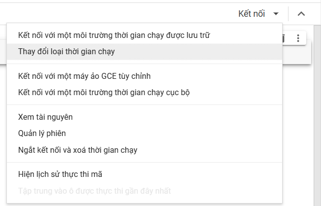

5. Chọn **T4 GPU** và bấm **Lưu**

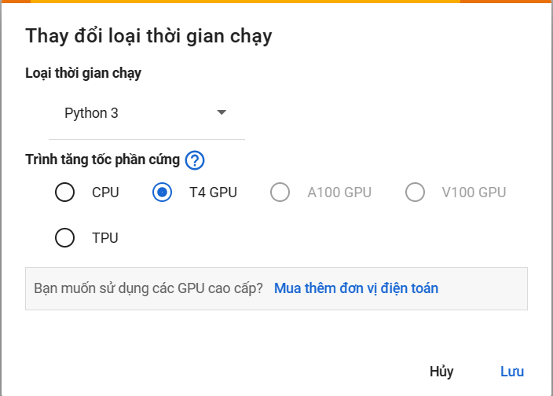

6. Bấm **Kết nối** và được như hình dưới

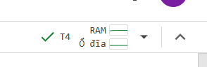

7. Chọn "Chạy tất cả"

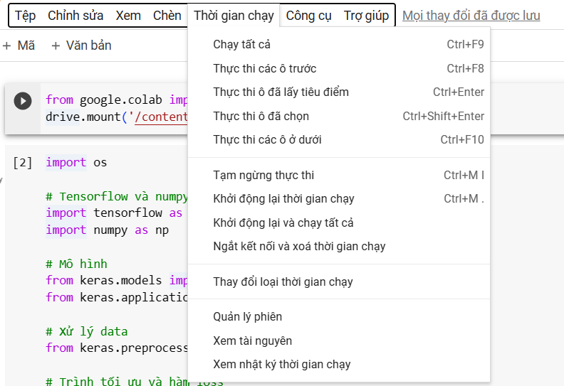

8. Chờ đợi và được kết quả là file **MobileNetV2_PlantVillage.h5** trên google drive của các bạn.

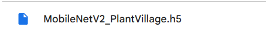

## Kết quả: Nhận được file trọng số .h5 để sử dụng trong Phần 2

# PHẦN 2: 

## Bước 1: Cài đặt Visual Studio code

Bấm [Visual Studio Code](https://code.visualstudio.com/download) để tải về Visual Studio Code

Chọn hệ điều hành phù hợp, ở đây hầu hết dùng Windows nên chọn Windows

## Bước 2: Cài đặt môi trường Python

Bấm [Python 3.10](https://www.python.org/ftp/python/3.10.0/python-3.10.0-amd64.exe) để tải về Python. (Có thể sử dụng version khác từ 3.8 đến dưới 3.12)

Chạy file cài đặt vừa được tải về. 

Chọn Run.

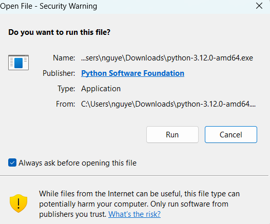

Tích chọn dòng "Add python.exe to PATH" ở dưới cùng hộp thoại (như hình)

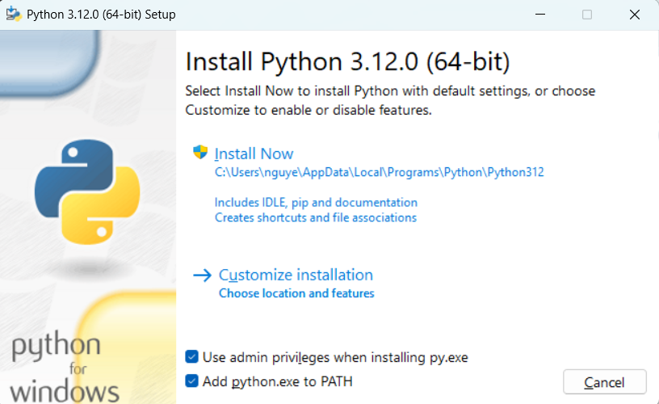

Sau đó bấm Install Now.

Chờ cài đặt và bấm Close

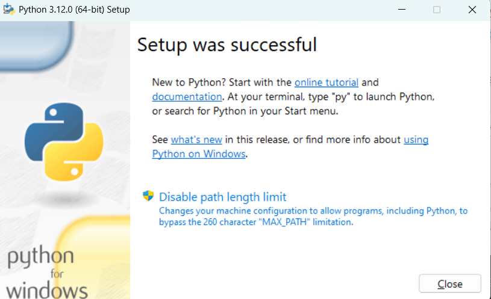
## Bước 3: Cài đặt Python trong Visual Studio Code

Mở Visual Studio Code lên. Nhìn sang thanh công cụ bên trái chọn Extension (biểu tượng 4 hình vuông). (Hoặc bấm Ctrl + Shift + X)


Tìm kiếm "Python". Bấm Install để cài đặt

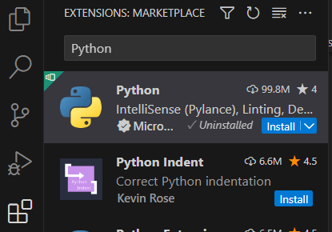

**Note**: Visual Studio code có thể yêu cầu thoát ra và vào lại.

## Bước 4: Clone folder github về máy

Chọn Code -> Download ZIP

Sau khi download file ZIP -> tiến hành unzip
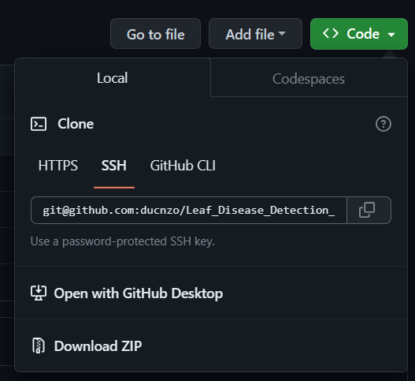

## Bước 5: Mở folder vừa được unzip bằng Visual Studio Code

File -> Open Folder. Dẫn đến vị trí folder vừa được unzip -> Chọn Open

*Note*: 

1. Trong code có thể thay đổi file tham số ""MobileNetV2_model.h5 bằng file tham số các bạn đã train ở **Phần 1**. 

2. Nếu sử dụng file trọng số mới của data PlantVillage, hãy thay đổi **class_labels = ["anthracnose", "downy_mildew", "fresh_leaf", "powdery_mildew"]** thành **class_labels = ["Apple___Apple_scab", "Apple___Black_rot", "Apple___Cedar_apple_rust", "Apple___healthy", "Background_without_leaves"]**

3. Các bạn có thể sử dụng data khác để train và nhận được file tham số. Nhưng nhớ thay đổi **file tham số** và **class_labels** theo cấu trúc data các bạn sử dụng.

## Bước 4: Cài đặt các package và thư viện

Trên thanh tác vụ của Visual Studio Code, chọn Terminal -> New Terminal

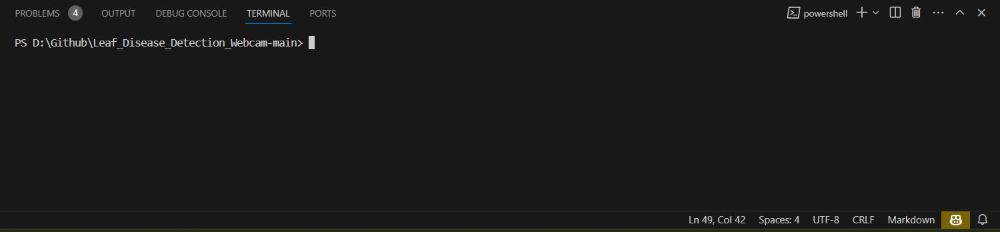

Copy lệnh dưới và dán vào cửa sổ terminal. Ấn Enter.

Cài đặt Tensorflow

```bash
pip install tensorflow
```

Tiếp tục copy code dưới đây dán vào terminal để cài đặt OpenCV

```bash
pip install opencv-python
```

Cuối cùng copy code dưới đây dán vào terminal ấn Enter để run

```bash
python main.py
```

Khi muốn kết thúc bấm nút "Q" để thoát.

**Tận hưởng thành quả nào !!!!**

